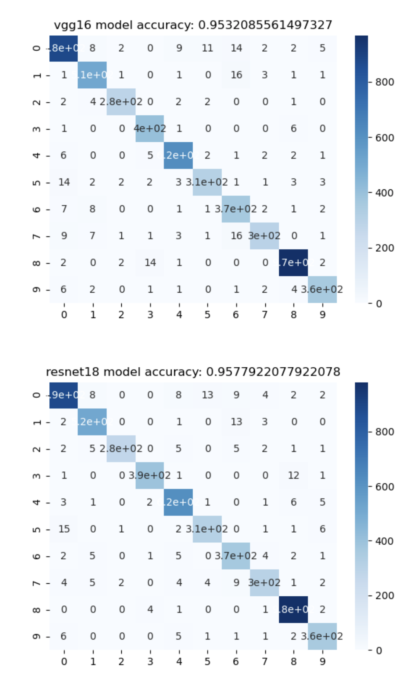

## 課題8
Animal10の画像分類をResNet18とVGG16のfine tuningを行い、両者の学習モデルを作成する  
その学習モデルから推論結果を取得し、評価、考察する

### compare_models.py
Animal10の画像分類をResNet18とVGG16のfine tuningを行い、両者の学習モデルを作成する

### show_diff.py
ResNet18とVGG16から作成した学習モデルの推論結果を取得する

### AITraining8.ipynb
学習データの展開、compare_models.pyの実行、show_diffの実行をSageMaker Notebookインスタンス上で行うコマンド

### diff_result
ResNet18とVGG16とで推論結果が異なる画像を格納
データ数100までのものだけ画像出力している

### 考察結果
ResNet18とVGG16との推論結果の違いを考察する

#### Confusion Matrixと精度の考察

ResNet18の方が精度が良い。VGG16よりも後発でさらに多層構造であるため優秀なのかなと感じる

#### 両者で推論結果が異なるものの比較

ResNet18が不正解の場合は、犬と判断していることが多い。これは不明なものはとりあえず犬としているのかも。一方でVGG16が不正解の場合は、鳥を蝶々や牛を馬とかかなり惜しい。両者で際どい推論判定の場合が異なることがわかり、面白い